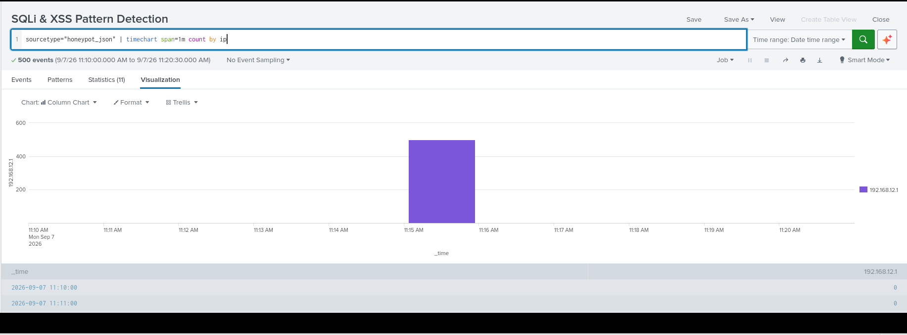
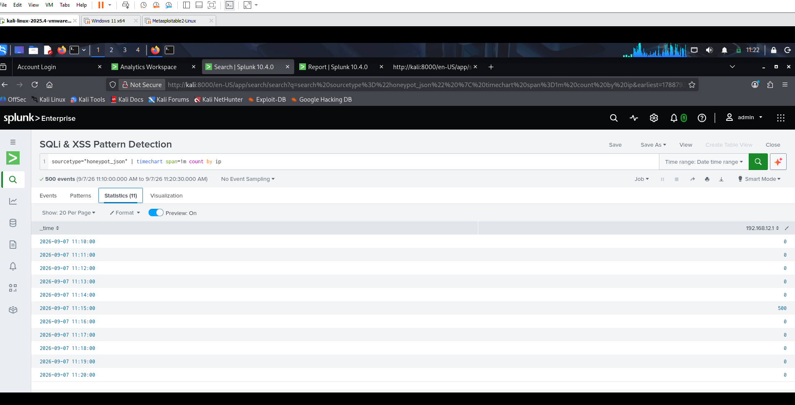

# Honeypot Web App & Log Pipeline

A deliberately vulnerable login page built to capture real attacker behavior — from raw HTTP logs to Splunk-based threat detection.

## Key Results

- **511 attack events** captured and cleanly parsed into structured, searchable fields
- **Brute-force detection query** isolated the attacking IP (500 attempts in a single 5-minute window) with **zero false positives**
- **SQLi/XSS detection query** correctly flagged 2 injected payloads out of 511 total events
- Built an automated **attack classification query** tagging every event as SQLi, XSS, or Brute Force
- Consolidated all detections into a single Splunk dashboard

## Why I Built This

Most beginner security projects analyze data someone else already collected. This one generates its own: a live target, real attack traffic from a separate machine, and detection logic written and validated against that traffic — the full loop from "build the target" to "catch the attacker."

## Architecture

```
[Fake Login Page]  --submits-->  [Flask Backend]  --logs-->  [attempts.log]
                                                                    |
[Kali Linux VM]  --attacks-->  [Flask Backend]                     |
   (Hydra, manual SQLi/XSS)                                        v
                                                          [Splunk Ingestion]
                                                                    |
                                                                    v
                                                  [Detection Queries + Dashboard]
```

## Skills Demonstrated

- **Backend development:** Python, Flask, structured JSON logging
- **Offensive security:** simulated brute-force (Hydra) and injection attacks (SQLi, XSS) against a live target
- **SIEM / detection engineering:** Splunk (SPL) — data ingestion, field extraction, time-windowed detection logic, event classification
- **Networking/troubleshooting:** cross-VM connectivity (VMware host-only networking), Windows Firewall configuration
- **Documentation:** translating a technical pipeline into a clear, reproducible writeup

## Tech Stack

`Python` · `Flask` · `Kali Linux` · `Hydra` · `Splunk Enterprise (SPL)` · `VMware Workstation`

## How It Works

1. `server.py` (Flask) serves a realistic login form and exposes a `/login` endpoint.
2. Every submission — real-looking or malicious — is logged as JSON (`timestamp`, `ip`, `username`, `password`, `user_agent`) to `attempts.log`. No credentials are ever validated; the page simply reloads, giving an attacker no feedback.
3. From a separate Kali Linux VM, attacks were run against the live server:
   - Manual SQLi/XSS payloads (e.g. `admin' --`, `<script>alert(1)</script>`)
   - An automated Hydra brute-force run against a 500-entry password list
4. `attempts.log` was ingested into Splunk and analyzed with custom detection queries.

## Detection Queries

**Brute-force detection** — flags any IP with >10 login attempts in a 5-minute window:
```spl
sourcetype="honeypot_json" | bucket _time span=5m | stats count by ip, _time | where count > 10
```

**Injection pattern detection** — flags SQLi/XSS payloads in submitted credentials:
```spl
sourcetype="honeypot_json" | search password="*'*" OR password="*--*" OR password="*<script>*"
```

**Attack classification** — auto-tags every event by type:
```spl
sourcetype="honeypot_json" | eval attack_type=case(match(password, "'|--"), "SQLi", match(password, "<script>"), "XSS", 1=1, "Brute Force/Other") | stats count by attack_type
```

## Evidence


| Brute-force spike (timeline) | Detection query results |
|---|---|
|  |  |

## Project Structure

```
honeypot-project/
├── server.py           # Flask app: serves the login page, logs every attempt
├── templates/
│   └── index.html      # Fake login form
└── logs/
    └── attempts.log    # JSON-formatted attempt log (generated at runtime)
```

## Setup

```bash
pip install flask
python server.py
# Visit http://localhost:5000
```

## Future Improvements

- Live shared-folder ingestion instead of manual log transfer
- Splunk alerting (requires Enterprise license — currently on Free)
- Expand payload variety (command injection, path traversal)

---
**Author:** Faaiziat Akanni
